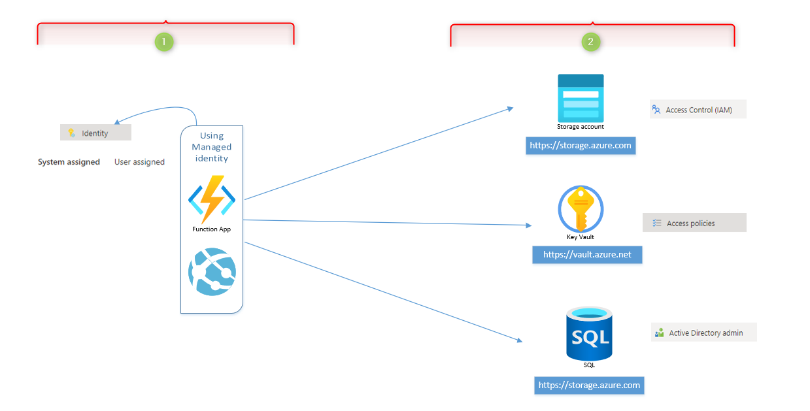
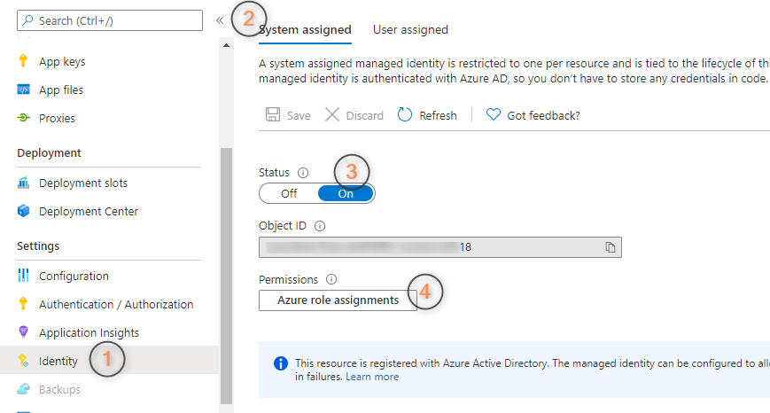
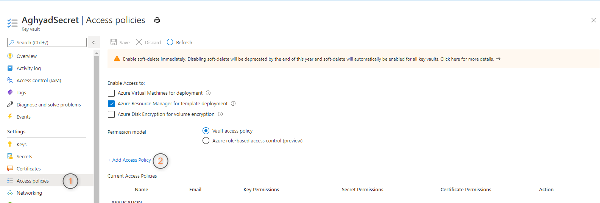
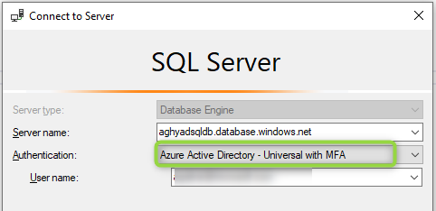

**Welcome to the Managed Identity Lab wiki!**

in this lab we will be able to use Managed Identity (User & System) to connect to the following from Function App : 
1. Storage Account.
2. Key Vault.
3. SQL DataBase.


**This is general overview about what this lab covers**



**As you can on the above image  we have to sides** :
### 1.  Function App or Web App:
  Brefily all what you need from App side is to **enable** the Managed Identity (System or User) and then start using it to have access to one of the above destinations.
   
##### I. System Identity 


##### II. User Identity


### 2. **Destination servies (Storage,KV,SQL ..etc )** 

I. **Storage Account** all what you need to **Add Azure role assignments** and azure will take care about the rest of steps .
 


##### II. **Key Vault** 

###### A. Add Access policies



###### B. Select principal : you need to select your App Name (Managed Identity Name) 


##### III. **SQL** 

1. Set you login account as Admin .
   


2. Login to SQL DB using this account 

 

3. Run the below Query :

```SQL
DROP USER IF EXISTS [YourAppName]
GO
CREATE USER [YourAppName] FROM EXTERNAL PROVIDER;
ALTER ROLE db_datareader ADD MEMBER [YourAppName];
ALTER ROLE db_datawriter ADD MEMBER [YourAppName];
ALTER ROLE db_ddladmin ADD MEMBER [YourAppName];
GRANT EXECUTE TO [YourAppName];
GO
```


**Note** Your local.settings.json should look like this : 

```JSON
{
  "IsEncrypted": false,
  "Values": {
    "AzureWebJobsStorage": "<XX>",
    "FUNCTIONS_WORKER_RUNTIME": "dotnet",
    "sqldb_connection": "Server=tcp:<XX>.database.windows.net,1433;Initial Catalog=<XX>;",
    "AppID": "<XX>",
    "KVURL": "<XX>",
    "StorageURL": "<XX>"
  }
}
```
